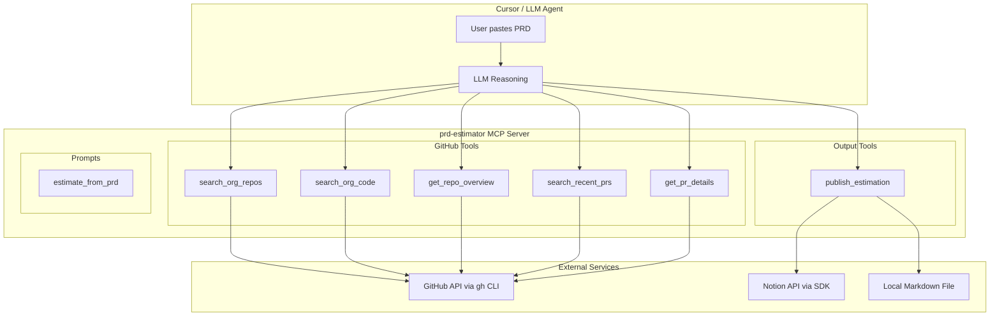

# PRD-to-Estimation MCP Server -- Design Document

## Design Philosophy

The MCP server should NOT try to do the AI reasoning itself. Instead, it exposes **tools** that give the LLM (Cursor) the capabilities to search GitHub, analyze repos, find PRs, and publish results. The LLM orchestrates the workflow and does the reasoning (understanding requirements, deciding relevance, estimating effort). The MCP handles the **data access and output formatting**.

A **prompt template** is also registered to guide the LLM through the full estimation workflow end-to-end.

## Architecture




## MCP Tools (6 total)

### 1. `search_org_repos`

Search repositories in the superbet-group org by keywords extracted from the PRD.

- **Input**: `query` (string), `language` (optional), `limit` (default 20)
- **Implementation**: Shells out to `gh search repos --owner=superbet-group "<query>" --json name,description,language,updatedAt,url --limit <limit>`
- **Returns**: Array of matching repos with name, description, language, last updated, URL

### 2. `search_org_code`

Search code across the org for specific patterns (service names, API endpoints, domain terms).

- **Input**: `query` (string), `filename` (optional), `language` (optional), `repo` (optional filter), `limit` (default 30)
- **Implementation**: `gh search code "<query>" --owner=superbet-group --json repo,path,textMatches --limit <limit>`
- **Returns**: Array of code matches with repo, file path, and match context

### 3. `get_repo_overview`

Get a structured overview of a specific repository (README, file tree, recent commits, tech stack).

- **Input**: `repo` (string, e.g. "superbet-group/loyalty-shop")
- **Implementation**: Combines multiple `gh` calls:
  - `gh repo view <repo> --json name,description,languages,defaultBranch`
  - `gh api repos/<repo>/git/trees/<branch>?recursive=1` (file tree, truncated to key dirs)
  - `gh api repos/<repo>/readme` (README content, truncated)
- **Returns**: Structured repo overview object

### 4. `search_recent_prs`

Search merged PRs across the org from the past N months, filterable by repo and keywords.

- **Input**: `query` (string), `months` (default 6), `repo` (optional), `limit` (default 30)
- **Implementation**: `gh search prs "<query>" --owner=superbet-group --merged --merged-after=<date> --json title,url,repository,author,mergedAt,additions,deletions --limit <limit>`
- **Returns**: Array of PRs with title, URL, repo, author, merge date, lines changed

### 5. `get_pr_details`

Get detailed information about a specific PR (description, files changed, review timeline).

- **Input**: `pr_url` (string, e.g. "[https://github.com/superbet-group/repo/pull/123](https://github.com/superbet-group/repo/pull/123)")
- **Implementation**: `gh pr view <url> --json title,body,files,additions,deletions,reviews,mergedAt,author`
- **Returns**: Full PR detail object

### 6. `publish_estimation`

Take structured estimation data and publish to both Notion and a local markdown file.

- **Input**:
  - `title` (string) -- estimation document title
  - `prd_summary` (string) -- brief summary of the requirements
  - `work_packages` (array of objects):
    - `name` (string)
    - `description` (string)
    - `impacted_repos` (string array)
    - `related_prs` (array of `{title, url}`)
    - `raw_estimate_days` (number)
    - `complexity` (low/medium/high)
  - `buffer_percent` (number, default 20)
  - `output_path` (string, default "./estimation.md")
- **Implementation**:
  1. Calculate buffered estimates: `raw * (1 + buffer/100)`
  2. Convert to person-weeks: `buffered_days / 5`
  3. Generate markdown table and write to `output_path`
  4. Create Notion page with the same content using `@notionhq/client`
- **Returns**: `{ markdown_path, notion_url }`

## Prompt Template

### `estimate_from_prd`

A registered MCP prompt that guides the LLM through the full workflow:

1. Parse the PRD to extract key features, domain terms, and technical keywords
2. Use `search_org_repos` and `search_org_code` to identify impacted repositories
3. Use `get_repo_overview` on the top candidates to understand their structure
4. Break features into work packages, mapping each to impacted repos
5. Use `search_recent_prs` to find comparable past changes for each work package
6. Use `get_pr_details` on the most relevant PRs to calibrate estimates
7. Estimate each work package in person-days based on PR complexity data
8. Call `publish_estimation` to output the final table with 20% buffer

## Project Structure

```
prd-estimator/
  package.json
  tsconfig.json
  src/
    index.ts              -- Server entry point, tool + prompt registration
    tools/
      search-repos.ts     -- search_org_repos implementation
      search-code.ts      -- search_org_code implementation
      repo-overview.ts    -- get_repo_overview implementation
      search-prs.ts       -- search_recent_prs implementation
      pr-details.ts       -- get_pr_details implementation
      publish.ts          -- publish_estimation (Notion + markdown)
    lib/
      gh.ts               -- Wrapper around gh CLI execution
      notion.ts           -- Notion API client setup
      markdown.ts         -- Markdown table formatting
    prompts/
      estimate-from-prd.ts -- Prompt template definition
```

## Dependencies

- `@modelcontextprotocol/server` -- MCP SDK
- `zod` -- Input validation
- `@notionhq/client` -- Notion API for publishing
- No additional GitHub dependency -- uses `gh` CLI (must be installed and authenticated)

## Cursor Integration

Register in `~/.cursor/mcp.json`:

```json
{
  "mcpServers": {
    "prd-estimator": {
      "type": "stdio",
      "command": "node",
      "args": ["/path/to/prd-estimator/build/index.js"],
      "env": {
        "NOTION_API_KEY": "<your-notion-integration-token>",
        "NOTION_PARENT_PAGE_ID": "<page-id-for-estimations>",
        "GITHUB_ORG": "superbet-group"
      }
    }
  }
}
```

## Key Design Decisions

- **gh CLI over GitHub REST API directly**: Avoids managing OAuth tokens separately -- `gh` handles auth. Also gives us access to the newer code search engine.
- **LLM does the reasoning, MCP does the data access**: The estimation logic (deciding what's relevant, sizing work) stays with the LLM where it's strongest. The MCP provides structured access to GitHub data.
- **Buffer is configurable**: Defaults to 20% but can be overridden per estimation.
- **Prompt template drives the workflow**: The `estimate_from_prd` prompt ensures consistency -- every estimation follows the same structured process regardless of which engineer runs it.

