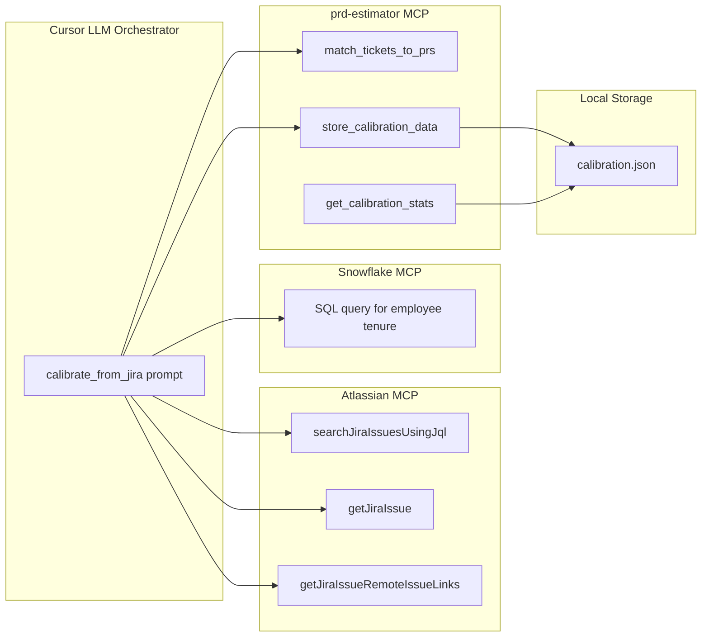

# Historical Calibration Extension -- Design Document

## Design Approach

Our MCP server runs as a stdio child process -- it **cannot** call the Atlassian or Snowflake MCP servers directly. Instead, we add tools that **accept pre-fetched data** and a **prompt template** that guides the LLM through the multi-MCP orchestration:

1. LLM uses **Atlassian MCP** to pull Jira tickets (already available)
2. LLM uses **prd-estimator MCP** to correlate tickets with GitHub PRs
3. LLM uses **Snowflake MCP** to query employee tenure (requires Snowflake setup)
4. LLM feeds everything into the **prd-estimator MCP** to build and store calibration data



## New Tools (3)

### 1. `match_tickets_to_prs`
For a batch of Jira ticket keys, search GitHub for linked/matching PRs.
- **Input**: `ticket_keys` (string array, e.g. `["PAM-123", "LOY-456"]`)
- **Implementation**: For each key, runs `gh search prs "<key>" --owner=superbet-group --merged --json ...`
- **Returns**: Map of ticket key to matched PRs with lines changed, files, merge date
- **File**: [src/tools/match-tickets.ts](src/tools/match-tickets.ts)

### 2. `store_calibration_data`
Takes structured ticket + PR + tenure data and builds a calibration JSON file with computed statistics.
- **Input**:
  - `tickets` -- array of ticket objects (key, summary, type, project, assignee, created, resolved, story_points)
  - `pr_matches` -- map of ticket key to PR data (from `match_tickets_to_prs` output)
  - `employee_tenure` -- map of assignee email/username to tenure in months at time of ticket
- **Computes and stores**:
  - Cycle time per ticket (resolved - created)
  - Lines changed per ticket (sum of PR additions + deletions)
  - Averages grouped by: issue type, complexity bucket, tenure bracket (0-6mo, 6-12mo, 12+mo)
  - Velocity percentiles (p25, p50, p75)
- **Writes to**: `/Users/shreyasjanivara/Desktop/planpage/estimation/calibration.json`
- **File**: [src/tools/store-calibration.ts](src/tools/store-calibration.ts)

### 3. `get_calibration_stats`
Reads the cached calibration JSON and returns summary statistics for use during estimation.
- **Input**: `filter_project` (optional), `filter_type` (optional)
- **Returns**: Aggregated stats (avg cycle time, avg lines changed, tenure impact multipliers, sample size)
- **File**: [src/tools/get-calibration.ts](src/tools/get-calibration.ts)

## New Prompt

### `calibrate_from_jira`
Guides the LLM through the full calibration workflow:

1. Use Atlassian MCP `getVisibleJiraProjects` to discover projects in the plan (cloudId: `axilis.atlassian.net`)
2. For each project, use `searchJiraIssuesUsingJql` with JQL: `project = X AND resolved >= -6m ORDER BY resolved DESC` (paginate with `nextPageToken`, max 100 per page)
3. Collect fields: key, summary, issuetype, status, assignee, created, resolutiondate, story_points
4. Batch ticket keys and call `match_tickets_to_prs` to find GitHub PRs
5. Use Snowflake MCP to query employee data: `SELECT email, hire_date FROM <hr_table> WHERE email IN (...)`
6. Calculate tenure at time of each ticket resolution
7. Feed everything into `store_calibration_data`
8. Report summary statistics

## Updated Prompt: `estimate_from_prd`

Update the existing estimation prompt to:
- Call `get_calibration_stats` at the start
- Use historical cycle times and lines-changed data to calibrate raw estimates
- Apply tenure-based multipliers (e.g. if the assigned team is junior, bump estimates)
- Reference specific past tickets as comparable evidence

## Calibration JSON Schema

```json
{
  "generated_at": "2026-04-17T20:00:00Z",
  "ticket_count": 245,
  "projects": ["PAM", "LOY", "CRM"],
  "tickets": [
    {
      "key": "PAM-123",
      "summary": "Add Supercoin expiry logic",
      "type": "Story",
      "project": "PAM",
      "assignee": "john.doe",
      "created": "2025-10-15",
      "resolved": "2025-10-25",
      "cycle_time_days": 10,
      "story_points": 5,
      "prs": [
        { "url": "...", "repo": "superbet-group/loyalp", "additions": 320, "deletions": 45, "files_changed": 8 }
      ],
      "assignee_tenure_months": 18
    }
  ],
  "statistics": {
    "by_issue_type": {
      "Story": { "count": 120, "avg_cycle_days": 8.5, "avg_lines": 450, "p50_cycle_days": 7, "p75_cycle_days": 12 },
      "Bug": { "count": 80, "avg_cycle_days": 3.2, "avg_lines": 120, "p50_cycle_days": 2, "p75_cycle_days": 5 }
    },
    "by_tenure_bracket": {
      "0-6_months": { "avg_cycle_multiplier": 1.6, "sample_size": 35 },
      "6-12_months": { "avg_cycle_multiplier": 1.2, "sample_size": 60 },
      "12+_months": { "avg_cycle_multiplier": 1.0, "sample_size": 150 }
    },
    "by_lines_changed_bucket": {
      "small_lt100": { "avg_cycle_days": 2.1 },
      "medium_100_500": { "avg_cycle_days": 6.3 },
      "large_gt500": { "avg_cycle_days": 14.2 }
    }
  }
}
```

## Snowflake Note

The Snowflake MCP requires setup (PAT token + server URL). During calibration, if Snowflake is not configured, the prompt will instruct the LLM to skip tenure data and note it as unavailable. Tenure multipliers will default to 1.0.

## Files Changed / Added

| File | Action |
|------|--------|
| `src/tools/match-tickets.ts` | **New** -- match Jira tickets to GitHub PRs |
| `src/tools/store-calibration.ts` | **New** -- build and save calibration JSON |
| `src/tools/get-calibration.ts` | **New** -- read calibration stats |
| `src/prompts/calibrate-from-jira.ts` | **New** -- calibration workflow prompt |
| `src/prompts/estimate-from-prd.ts` | **Update** -- reference calibration data |
| `src/index.ts` | **Update** -- register 3 new tools + 1 new prompt |
